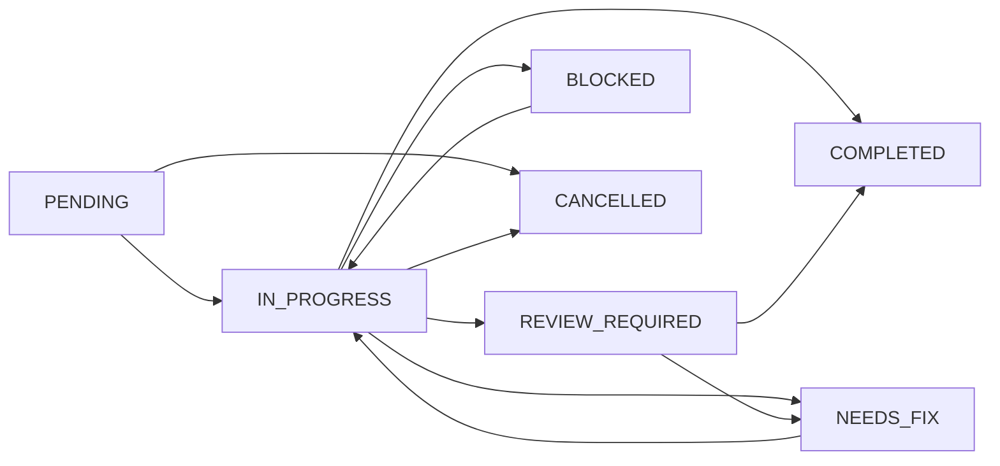

Task tools manage the task lifecycle in Routa. They handle task creation, status updates, assignment tracking, and optimistic locking for concurrent updates.

<Warning>
  Task tools are **only available in full mode**. In essential mode, tasks are created automatically from `@@@task` blocks via `set_note_content`.
</Warning>

## Available in Full Mode Only

### create_task

Create a new task in the task store. Returns the taskId for later delegation.

<ParamField path="title" type="string" required>
  Task title
</ParamField>

<ParamField path="objective" type="string" required>
  What this task should achieve
</ParamField>

<ParamField path="workspaceId" type="string" optional>
  Workspace ID (uses default if omitted)
</ParamField>

<ParamField path="scope" type="string" optional>
  What files/areas are in scope
</ParamField>

<ParamField path="acceptanceCriteria" type="string[]" optional>
  List of acceptance criteria / definition of done
</ParamField>

<ParamField path="verificationCommands" type="string[]" optional>
  Commands to run for verification
</ParamField>

<ParamField path="dependencies" type="string[]" optional>
  Task IDs that must complete first
</ParamField>

<ParamField path="parallelGroup" type="string" optional>
  Group ID for parallel execution
</ParamField>

**Returns:**
```json
{
  "taskId": "dda97509-b414-4c50-9835-73a1ec2f...",
  "title": "Implement JWT authentication",
  "status": "PENDING"
}
```

**Usage:**
```typescript
const result = await tools.createTask({
  title: "Implement JWT authentication",
  objective: "Add JWT-based auth to the API with refresh tokens",
  scope: "src/auth/ directory only",
  acceptanceCriteria: [
    "Login endpoint returns JWT access token",
    "Refresh endpoint extends session",
    "Protected routes verify JWT"
  ],
  verificationCommands: [
    "npm test -- auth",
    "curl -X POST /api/login -d '{...}'"
  ],
  workspaceId
});

const taskId = result.taskId;  // Use this UUID for delegation
```

<Info>
  In **essential mode**, use `set_note_content` with `@@@task` blocks instead — it auto-creates tasks and returns their UUIDs.
</Info>

---

### list_tasks

List all tasks in the workspace with their status, assignee, and verification verdict.

<ParamField path="workspaceId" type="string" optional>
  Workspace ID (uses default if omitted)
</ParamField>

**Returns:**
```json
[
  {
    "id": "task-uuid-1",
    "title": "Implement JWT auth",
    "status": "IN_PROGRESS",
    "assignedTo": "agent-uuid",
    "verificationVerdict": null
  },
  {
    "id": "task-uuid-2",
    "title": "Add rate limiting",
    "status": "PENDING",
    "assignedTo": null,
    "verificationVerdict": null
  }
]
```

**Usage:**
```typescript
// See all tasks and their status
const tasks = await tools.listTasks(workspaceId);

// Find pending tasks
const pending = tasks.filter(t => t.status === "PENDING");

// Find tasks assigned to a specific agent
const myTasks = tasks.filter(t => t.assignedTo === myAgentId);
```

---

### update_task_status

Atomically update a task's status. Emits `TASK_STATUS_CHANGED` event.

<ParamField path="taskId" type="string" required>
  ID of the task to update
</ParamField>

<ParamField path="status" type="string" required>
  New task status: `PENDING`, `IN_PROGRESS`, `REVIEW_REQUIRED`, `COMPLETED`, `NEEDS_FIX`, `BLOCKED`, or `CANCELLED`
</ParamField>

<ParamField path="agentId" type="string" required>
  ID of the agent performing the update
</ParamField>

<ParamField path="summary" type="string" optional>
  Completion summary (for `COMPLETED` or `NEEDS_FIX` status)
</ParamField>

**Returns:**
```json
{
  "taskId": "task-uuid",
  "oldStatus": "IN_PROGRESS",
  "newStatus": "COMPLETED",
  "updatedAt": "2024-03-03T10:30:00Z"
}
```

**Usage:**
```typescript
// Mark task as completed
await tools.updateTaskStatus({
  taskId: myTaskId,
  status: "COMPLETED",
  agentId: myAgentId,
  summary: "JWT auth implemented with refresh tokens. All tests passing."
});

// Mark task as needing fixes
await tools.updateTaskStatus({
  taskId: taskId,
  status: "NEEDS_FIX",
  agentId: verifierId,
  summary: "Token expiry validation is missing"
});
```

<Info>
  This tool emits events that can be caught by agents subscribed via `subscribe_to_events`.
</Info>

---

### update_task

Atomically update task fields with **optimistic locking**. Prevents concurrent modification conflicts.

<ParamField path="taskId" type="string" required>
  ID of the task to update
</ParamField>

<ParamField path="expectedVersion" type="number" optional>
  Expected version for optimistic locking (from prior task read)
</ParamField>

<ParamField path="agentId" type="string" required>
  ID of the agent performing the update
</ParamField>

<ParamField path="title" type="string" optional>
  Update the task title
</ParamField>

<ParamField path="objective" type="string" optional>
  Update the task objective
</ParamField>

<ParamField path="scope" type="string" optional>
  Update the task scope
</ParamField>

<ParamField path="status" type="string" optional>
  Update the task status
</ParamField>

<ParamField path="completionSummary" type="string" optional>
  Set completion summary
</ParamField>

<ParamField path="verificationVerdict" type="string" optional>
  Set verification verdict: `APPROVED`, `NOT_APPROVED`, or `BLOCKED`
</ParamField>

<ParamField path="verificationReport" type="string" optional>
  Set verification report
</ParamField>

<ParamField path="assignedTo" type="string" optional>
  Assign to agent ID
</ParamField>

<ParamField path="acceptanceCriteria" type="string[]" optional>
  Update acceptance criteria
</ParamField>

**Returns:**
```json
{
  "taskId": "task-uuid",
  "version": 3,
  "updatedFields": ["verificationVerdict", "verificationReport"],
  "updatedAt": "2024-03-03T10:45:00Z"
}
```

**Usage with optimistic locking:**
```typescript
// 1. Read the task to get current version
const task = await tools.getTask(taskId);
const currentVersion = task.version;

// 2. Update with expected version
const result = await tools.updateTask({
  taskId,
  expectedVersion: currentVersion,
  agentId: verifierId,
  verificationVerdict: "APPROVED",
  verificationReport: "All acceptance criteria verified."
});

// If another agent modified the task, you'll get a version conflict error
```

**Usage without version check:**
```typescript
// Simpler update (no conflict detection)
await tools.updateTask({
  taskId,
  agentId: myAgentId,
  status: "IN_PROGRESS",
  assignedTo: myAgentId
});
```

<Warning>
  If `expectedVersion` is provided and doesn't match the current version, the update fails with:
  
  ```
  Version conflict: expected 2, current 3. Re-read the task and retry with the latest version.
  ```
  
  This prevents concurrent modifications from overwriting each other.
</Warning>

---

## Task Status Lifecycle



**Status meanings:**

- `PENDING`: Task created but not yet assigned
- `IN_PROGRESS`: Agent actively working on the task
- `REVIEW_REQUIRED`: Implementation complete, awaiting verification
- `COMPLETED`: Task verified and accepted
- `NEEDS_FIX`: Verification found issues, needs rework
- `BLOCKED`: Task cannot proceed (dependency or external blocker)
- `CANCELLED`: Task abandoned

---

## Verification Verdicts

GATE agents use `update_task` to set verification verdicts:

- `APPROVED`: All acceptance criteria verified
- `NOT_APPROVED`: Issues found, task needs fixes
- `BLOCKED`: Cannot verify (missing info, environment issues, etc.)

**Example verification flow:**
```typescript
// GATE agent verifying a task
const task = await tools.getTask(taskId);

// Run verification commands
const testResults = await runTests(task.verificationCommands);

if (testResults.allPassing) {
  await tools.updateTask({
    taskId,
    agentId: myAgentId,
    verificationVerdict: "APPROVED",
    verificationReport: "✅ All acceptance criteria verified\n" +
      "- Login returns JWT: PASS\n" +
      "- Refresh extends session: PASS\n" +
      "- Protected routes verify JWT: PASS"
  });
  
  await tools.updateTaskStatus({
    taskId,
    status: "COMPLETED",
    agentId: myAgentId
  });
} else {
  await tools.updateTask({
    taskId,
    agentId: myAgentId,
    verificationVerdict: "NOT_APPROVED",
    verificationReport: "❌ Issues found:\n" +
      "- Token expiry validation missing\n" +
      "- Refresh endpoint returns 401 on invalid token"
  });
  
  await tools.updateTaskStatus({
    taskId,
    status: "NEEDS_FIX",
    agentId: myAgentId,
    summary: "Verification failed: missing expiry validation"
  });
}
```

---

## Task Dependencies and Parallel Groups

### Dependencies

Tasks can depend on other tasks completing first:

```typescript
const migrationTask = await tools.createTask({
  title: "Migrate auth to JWT",
  objective: "Replace session-based auth with JWT",
  workspaceId
});

const testTask = await tools.createTask({
  title: "Update auth tests",
  objective: "Adapt tests for JWT auth",
  dependencies: [migrationTask.taskId],  // Wait for migration
  workspaceId
});
```

### Parallel Groups

Tasks in the same parallel group can run concurrently:

```typescript
const uiTask = await tools.createTask({
  title: "Update login UI",
  objective: "Add JWT token display",
  parallelGroup: "wave1",
  workspaceId
});

const apiTask = await tools.createTask({
  title: "Add refresh endpoint",
  objective: "Implement /api/refresh",
  parallelGroup: "wave1",
  workspaceId
});

// Delegate both with after_all wait mode
for (const taskId of [uiTask.taskId, apiTask.taskId]) {
  await tools.delegateTaskToAgent({
    taskId,
    callerAgentId: coordinatorId,
    specialist: "CRAFTER",
    waitMode: "after_all"  // Notified when ALL in wave1 complete
  });
}
```

---

## Common Patterns

### Create and Delegate

```typescript
// 1. Create task
const task = await tools.createTask({
  title: "Implement auth",
  objective: "Add JWT authentication",
  acceptanceCriteria: [
    "Login endpoint works",
    "Protected routes require JWT"
  ],
  workspaceId
});

// 2. Delegate to a CRAFTER
await tools.delegateTaskToAgent({
  taskId: task.taskId,
  callerAgentId: coordinatorId,
  specialist: "CRAFTER"
});
```

### Track Task Progress

```typescript
// List all tasks and check status
const tasks = await tools.listTasks(workspaceId);

const inProgress = tasks.filter(t => t.status === "IN_PROGRESS");
const completed = tasks.filter(t => t.status === "COMPLETED");
const needsFix = tasks.filter(t => t.status === "NEEDS_FIX");

console.log(`Progress: ${completed.length}/${tasks.length} tasks done`);
console.log(`In flight: ${inProgress.length}`);
console.log(`Needs attention: ${needsFix.length}`);
```

### Safe Concurrent Updates

```typescript
// Multiple agents updating the same task
async function safeUpdateTask(taskId: string, updates: any) {
  const task = await tools.getTask(taskId);
  
  try {
    return await tools.updateTask({
      taskId,
      expectedVersion: task.version,
      agentId: myAgentId,
      ...updates
    });
  } catch (err) {
    if (err.message.includes("Version conflict")) {
      // Another agent modified the task, retry
      return safeUpdateTask(taskId, updates);
    }
    throw err;
  }
}
```

---

## See Also

- [Agent Tools](/api/mcp-tools/agent-tools) - Delegation and coordination
- [Note Tools](/api/mcp-tools/note-tools) - Task blocks and spec workflow
- [Task Orchestration](/concepts/task-orchestration) - Coordination patterns