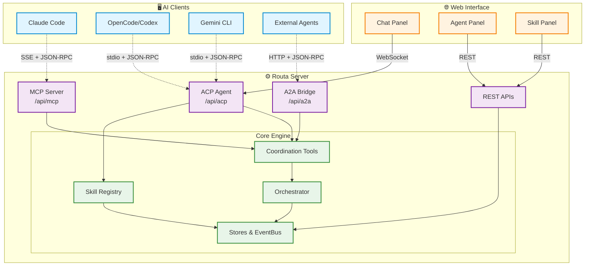
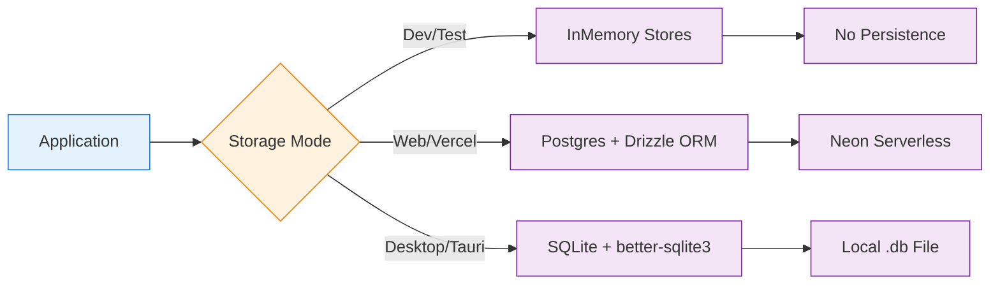

## Overview

Routa is a **multi-agent coordination platform** built with a **dual-backend architecture** to support both web deployment and desktop distribution:

- **Next.js Backend** (TypeScript) — Web deployment on Vercel with Postgres/SQLite
- **Rust Backend** (Axum) — Desktop application (`routa-server` crate) with embedded server and SQLite

Both backends implement **identical REST APIs** for seamless frontend compatibility.

<Note>
  The Tauri desktop application is the **primary distribution target**. The web version is available for demo purposes only.
</Note>

## High-Level Architecture



## Core Components

### RoutaSystem

The central system object that holds all stores, event bus, and tools. Located in `src/core/routa-system.ts:31-52`.

<Accordion title="RoutaSystem Interface">
```typescript
export interface RoutaSystem {
  agentStore: AgentStore;
  conversationStore: ConversationStore;
  taskStore: TaskStore;
  noteStore: NoteStore;
  workspaceStore: WorkspaceStore;
  codebaseStore: CodebaseStore;
  backgroundTaskStore: BackgroundTaskStore;
  scheduleStore: ScheduleStore;
  workflowRunStore: WorkflowRunStore;
  eventBus: EventBus;
  tools: AgentTools;
  noteTools: NoteTools;
  workspaceTools: WorkspaceTools;
  crdtManager: CRDTDocumentManager;
  noteBroadcaster: NoteEventBroadcaster;
  isPersistent: boolean;
}
```
</Accordion>

The system supports **three storage modes** (`src/core/routa-system.ts:5-8`):

1. **InMemory** (no database) — For quick development and tests
2. **Postgres** (`DATABASE_URL` set) — Neon Serverless via Drizzle ORM for web/Vercel deployments
3. **SQLite** (`ROUTA_DB_DRIVER=sqlite` or desktop) — Local file via better-sqlite3 for Tauri/Electron

### Orchestrator

The **core orchestration engine** that bridges MCP tool calls with actual ACP process spawning. Located in `src/core/orchestration/orchestrator.ts:17-16`.

<Info>
  **Orchestration Flow**: When a coordinator delegates a task, the orchestrator:
  1. Checks delegation depth (max 2 levels)
  2. Resolves specialist configuration
  3. Creates a child agent record with metadata
  4. Spawns a real ACP process for the child agent
  5. Sends the task as the initial prompt
  6. Subscribes for completion events
  7. Wakes the parent agent when the child reports back
</Info>

Key responsibilities (`src/core/orchestration/orchestrator.ts:217-425`):
- **Delegation depth tracking** — Prevents infinite recursion (max 2 levels)
- **Agent lifecycle management** — Creates, spawns, and tracks child agents
- **Parent wake-up coordination** — Notifies parent agents when children complete
- **Wait mode handling** — Supports `immediate` and `after_all` delegation patterns

### Coordination Tools

Provides 12 coordination tools for multi-agent collaboration (`src/core/tools/agent-tools.ts:4-23`):

**Core tools (6)**:
1. `listAgents` — List agents in a workspace
2. `readAgentConversation` — Read another agent's conversation
3. `createAgent` — Create ROUTA/CRAFTER/GATE agents
4. `delegate` — Assign task to agent
5. `messageAgent` — Inter-agent messaging
6. `reportToParent` — Completion report to parent

**Task-agent lifecycle (4)**:
7. `wakeOrCreateTaskAgent` — Wake or create agent for task
8. `sendMessageToTaskAgent` — Message to task's assigned agent
9. `getAgentStatus` — Agent status
10. `getAgentSummary` — Agent summary

**Event subscription (2)**:
11. `subscribeToEvents` — Subscribe to workspace events
12. `unsubscribeFromEvents` — Unsubscribe

### EventBus

A lightweight in-process pub/sub system for coordinating agent activities. Emits events like:
- `TASK_ASSIGNED` — Task delegated to agent
- `REPORT_SUBMITTED` — Agent completed and reported back
- `AGENT_ERROR` — Agent encountered an error

## Storage Architecture

### Three-Tier Storage Strategy



<Accordion title="Storage Mode Selection Logic">
From `src/core/routa-system.ts:267-288`:

```typescript
export function getRoutaSystem(): RoutaSystem {
  const g = globalThis as Record<string, unknown>;
  if (!g[GLOBAL_KEY]) {
    const driver = getDatabaseDriver();
    
    switch (driver) {
      case "postgres":
        console.log("[RoutaSystem] Initializing with Postgres (Neon) stores");
        g[GLOBAL_KEY] = createPgSystem();
        break;
      case "sqlite":
        console.log("[RoutaSystem] Initializing with SQLite stores (desktop)");
        g[GLOBAL_KEY] = createSqliteSystem();
        break;
      default:
        console.log("[RoutaSystem] Initializing with InMemory stores (no database)");
        g[GLOBAL_KEY] = createInMemorySystem();
        break;
    }
  }
  return g[GLOBAL_KEY] as RoutaSystem;
}
```
</Accordion>

### Workspace-Centric Data Model

**Every agent, task, and note belongs to a workspace**. This design enables:
- Multi-project isolation
- GitHub virtual workspace imports (no local clone required)
- Workspace-scoped agent collaboration

## Delegation Depth Tracking

To prevent unbounded recursive agent creation, Routa enforces a **maximum delegation depth of 2 levels** (`src/core/orchestration/delegation-depth.ts:17-21`):

- **Depth 0**: User-created agents (no delegation)
- **Depth 1**: First-level delegated agents (children of user-created agents)
- **Depth 2**: Second-level delegated agents (grandchildren - maximum allowed)

<Tip>
  When an agent at depth 2 tries to delegate, the orchestrator returns an error: "Cannot create sub-agent: maximum delegation depth (2) reached."
</Tip>

Delegation metadata is stored in `Agent.metadata` (`src/core/orchestration/delegation-depth.ts:127-148`):

```typescript
export function buildAgentMetadata(
  depth: number,
  createdByAgentId?: string,
  specialist?: string,
  additionalMetadata?: Record<string, string>
): Record<string, string> {
  const metadata: Record<string, string> = {
    ...createDelegationMetadata(depth),
    ...additionalMetadata,
  };
  
  if (createdByAgentId) {
    metadata.createdByAgentId = createdByAgentId;
  }
  
  if (specialist) {
    metadata.specialist = specialist;
  }
  
  return metadata;
}
```

## CLI (Rust)

The desktop distribution includes a `routa` CLI built on the same `routa-core` logic as the Rust server:

```bash
routa -p "Implement feature X"    # Full coordinator flow
routa agent list|create|status    # Agent management
routa task list|create|get        # Task management
routa chat                        # Interactive chat
```

## Next Steps

<CardGroup cols={2}>
  <Card title="Multi-Agent Coordination" icon="users" href="/concepts/multi-agent-coordination">
    Learn how agents collaborate through MCP tools
  </Card>
  <Card title="Specialist Roles" icon="user-tie" href="/concepts/specialist-roles">
    Understanding ROUTA, CRAFTER, GATE, and DEVELOPER roles
  </Card>
  <Card title="Task Orchestration" icon="sitemap" href="/concepts/task-orchestration">
    How tasks are created, delegated, and verified
  </Card>
  <Card title="Protocol Overview" icon="network-wired" href="/concepts/protocols">
    Deep dive into MCP, ACP, and A2A protocols
  </Card>
</CardGroup>