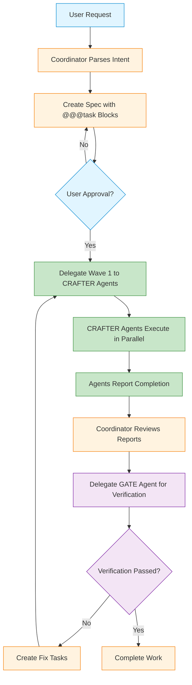

## Overview

Routa orchestrates AI agents to collaborate on complex development tasks through **specialized roles** and **real-time coordination**. Instead of a single AI handling everything, Routa enables multiple agents to work together—one plans, another implements, and a third verifies—creating a more robust and scalable development workflow.

<Info>
  **Core Principle**: Routa parses natural language into structured intent (Spec with Tasks), then shares this unified intent across all downstream agents, ensuring **context consistency** throughout the workflow.
</Info>

## Coordination Patterns

### Intent-Driven Workflow

Routa follows a structured workflow from user request to verified completion:



### Delegation and Wake-up Pattern

The orchestrator implements a **parent-child delegation pattern** with automatic wake-up (`src/core/orchestration/orchestrator.ts:217-425`):

1. **Parent agent** calls `delegate_task_to_agent` via MCP
2. **Orchestrator** spawns a real ACP process for the child agent
3. **Child agent** receives task as initial prompt and starts working
4. **Child agent** calls `report_to_parent` when complete
5. **Orchestrator** wakes parent agent with completion report
6. **Parent agent** reviews results and decides next steps

<Accordion title="Wake-up Implementation">
From `src/core/orchestration/orchestrator.ts:819-901`:

```typescript
private async wakeParent(
  record: ChildAgentRecord,
  groupId?: string
): Promise<void> {
  const { parentAgentId, parentSessionId, taskId } = record;
  
  // Build a wake-up message with completion details
  let wakeMessage: string;
  
  if (groupId) {
    // After_all mode: wait for all agents in group
    const group = this.delegationGroups.get(groupId);
    const reports = [];
    if (group) {
      for (const childId of group.childAgentIds) {
        const childRecord = this.childAgents.get(childId);
        if (childRecord) {
          const agent = await this.system.agentStore.get(childId);
          const task = await this.system.taskStore.get(childRecord.taskId);
          reports.push(
            `- **${agent?.name ?? childId}** (${childRecord.role}): ` +
              `Task "${task?.title ?? childRecord.taskId}" → ` +
              `${task?.status ?? "unknown"}`
          );
          if (task?.completionSummary) {
            reports.push(`  Summary: ${task.completionSummary}`);
          }
        }
      }
    }
    wakeMessage =
      `## Delegation Group Complete\n\n` +
      `All ${group?.childAgentIds.length ?? 0} delegated agents have completed:\n\n` +
      reports.join("\n") +
      `\n\nReview the results and decide next steps.`;
  } else {
    // Immediate mode: wake on single agent completion
    const agent = await this.system.agentStore.get(record.agentId);
    const task = await this.system.taskStore.get(taskId);
    wakeMessage =
      `## Agent Completion Report\n\n` +
      `**Agent:** ${agent?.name ?? record.agentId} (${record.role})\n` +
      `**Task:** ${task?.title ?? taskId}\n` +
      `**Status:** ${task?.status ?? "unknown"}\n` +
      (task?.completionSummary
        ? `**Summary:** ${task.completionSummary}\n`
        : "") +
      `\nReview the results and decide next steps.`;
  }
  
  // Send the wake-up message as a new prompt to the parent's session
  await this.sendPromptToSession(parentSessionId, wakeMessage);
}
```
</Accordion>

## Wait Modes

Routa supports two delegation wait modes:

### Immediate Mode (Default)

Parent agent is woken up **immediately** when a child completes:

```typescript
// Delegate and wake immediately when complete
await delegate_task_to_agent({
  taskId: "task-123",
  specialist: "CRAFTER",
  waitMode: "immediate"
});
```

**Use case**: Sequential tasks where the parent needs to review each result before proceeding.

### After-All Mode

Parent agent is woken up **only after ALL agents in the delegation group** complete:

```typescript
// Delegate multiple tasks and wait for all
await delegate_task_to_agent({
  taskId: "task-1",
  specialist: "CRAFTER",
  waitMode: "after_all"
});

await delegate_task_to_agent({
  taskId: "task-2",
  specialist: "CRAFTER",
  waitMode: "after_all"
});

// Parent wakes when BOTH complete
```

**Use case**: Parallel tasks that must all complete before the next phase (e.g., Wave 1 implementation before verification).

<Tip>
  After-all mode enables **true parallel execution** where multiple CRAFTER agents work simultaneously on independent tasks.
</Tip>

## Inter-Agent Communication

### Direct Messaging

Agents can send messages to each other using `send_message_to_agent`:

```typescript
await send_message_to_agent({
  fromAgentId: "agent-a",
  toAgentId: "agent-b",
  message: "The API endpoint structure has changed. Please update your integration code accordingly."
});
```

### Conversation Reading

Agents can read each other's conversation history using `read_agent_conversation` (`src/core/tools/agent-tools.ts:121-167`):

```typescript
// Read last 10 messages
await read_agent_conversation({
  agentId: "agent-b",
  lastN: 10,
  includeToolCalls: false
});

// Read specific turn range
await read_agent_conversation({
  agentId: "agent-b",
  startTurn: 5,
  endTurn: 10
});
```

<Note>
  Agents use conversation reading to **coordinate and avoid conflicts** when working on related files.
</Note>

### Report to Parent

Child agents **must** call `report_to_parent` when completing their work:

```typescript
await report_to_parent({
  agentId: "agent-child",
  report: {
    agentId: "agent-child",
    taskId: "task-123",
    summary: "Implemented authentication endpoints. All tests pass.",
    success: true,
    filesModified: ["src/auth/routes.ts", "src/auth/middleware.ts"],
    verificationResults: "npm test -- auth\n✓ 12 tests passed"
  }
});
```

<Warning>
  Without calling `report_to_parent`, the orchestrator won't know the child agent has completed. After a timeout (2 seconds), the orchestrator will auto-report on behalf of the agent.
</Warning>

## Preflight Conflict Checks

Before starting work, CRAFTER agents are instructed to check what other agents are working on to avoid conflicts:

```typescript
// CRAFTER preflight check
const agents = await list_agents({ workspaceId: "workspace-1" });

for (const agent of agents) {
  if (agent.status === "ACTIVE") {
    const conversation = await read_agent_conversation({
      agentId: agent.id,
      lastN: 5
    });
    // Check if agent is working on related files
  }
}
```

This pattern is embedded in the CRAFTER system prompt (`src/core/orchestration/specialist-prompts.ts:113-144`):

> **Preflight conflict check**: Use `list_agents` to see what others are working on

## Event-Driven Coordination

The EventBus enables reactive coordination patterns:

```typescript
// Subscribe to workspace events
eventBus.on("task-completion-handler", (event) => {
  if (event.type === AgentEventType.TASK_ASSIGNED) {
    console.log(`Task ${event.data.taskTitle} assigned to ${event.agentId}`);
  }
  
  if (event.type === AgentEventType.REPORT_SUBMITTED) {
    console.log(`Agent ${event.agentId} completed work`);
  }
});
```

Key event types (`src/events/event-bus.ts`):
- `TASK_ASSIGNED` — Task delegated to agent
- `REPORT_SUBMITTED` — Agent completed and reported back
- `AGENT_ERROR` — Agent encountered an error
- `MESSAGE_SENT` — Inter-agent message sent

## Session Management

The orchestrator tracks child agents and their ACP sessions (`src/core/orchestration/orchestrator.ts:83-106`):

```typescript
interface ChildAgentRecord {
  agentId: string;
  sessionId: string;
  parentAgentId: string;
  parentSessionId: string;
  taskId: string;
  role: AgentRole;
  provider: string;
  delegationToolCallId?: string;
}
```

Child sessions are automatically:
- Registered in the UI sidebar
- Tracked for cleanup on parent termination
- Connected to the MCP server with workspace context

## Real-Time Updates

Child agent activities are forwarded to the parent session via SSE notifications:

```typescript
const notificationHandler: NotificationHandler = (msg) => {
  if (msg.method === "session/update" && msg.params) {
    const params = msg.params as Record<string, unknown>;
    
    // Forward notifications to the parent session's SSE
    if (this.notificationHandler) {
      this.notificationHandler(parentSessionId, {
        ...params,
        sessionId: parentSessionId,
        childAgentId: agentId,
        childSessionId: sessionId,
      });
    }
  }
};
```

This enables the UI to show real-time progress for all active agents in a workspace.

## Next Steps

<CardGroup cols={2}>
  <Card title="Specialist Roles" icon="user-tie" href="/concepts/specialist-roles">
    Learn about ROUTA, CRAFTER, GATE, and DEVELOPER roles
  </Card>
  <Card title="Task Orchestration" icon="sitemap" href="/concepts/task-orchestration">
    Deep dive into task creation and delegation
  </Card>
  <Card title="System Architecture" icon="diagram-project" href="/concepts/architecture">
    Understand the dual-backend architecture
  </Card>
  <Card title="Protocols" icon="network-wired" href="/concepts/protocols">
    Learn about MCP, ACP, and A2A protocols
  </Card>
</CardGroup>