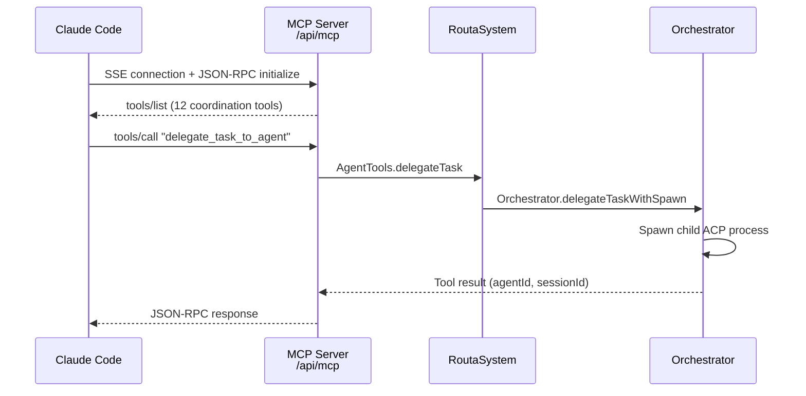
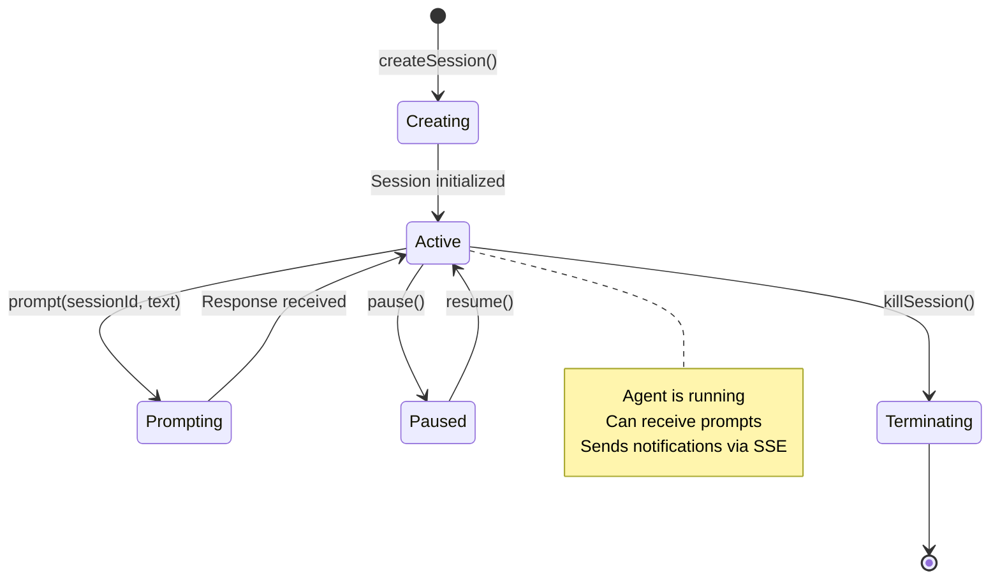
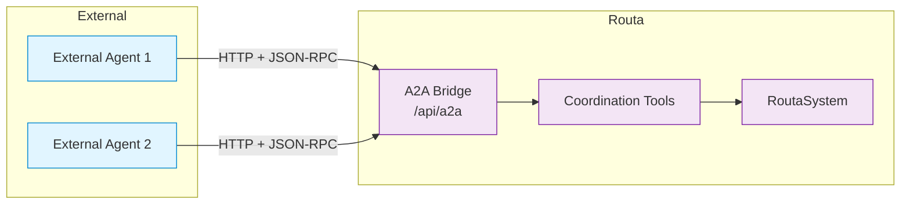

## Overview

Routa implements a **multi-protocol architecture** to enable coordination between diverse AI platforms and agents:

<CardGroup cols={3}>
  <Card title="MCP" icon="tools">
    **Model Context Protocol**
    
    Coordination tools for agent collaboration (task delegation, messaging, notes)
  </Card>
  <Card title="ACP" icon="terminal">
    **Agent Client Protocol**
    
    Spawns and manages agent processes (Claude Code, OpenCode, Codex, Gemini)
  </Card>
  <Card title="A2A" icon="network-wired">
    **Agent-to-Agent Protocol**
    
    Exposes external federation interface for cross-platform agent communication
  </Card>
</CardGroup>

<Note>
  Each protocol serves a distinct purpose: **MCP for tools**, **ACP for process management**, and **A2A for external federation**.
</Note>

## MCP (Model Context Protocol)

### Overview

MCP is Anthropic's protocol for exposing **tools and context** to AI models. Routa implements an MCP server at `/api/mcp` that provides 12+ coordination tools.

**Protocol**: JSON-RPC over SSE (Server-Sent Events) or stdio  
**Server**: `src/app/api/mcp/route.ts`  
**Tools**: `src/core/tools/agent-tools.ts`, `src/core/tools/note-tools.ts`, `src/core/tools/workspace-tools.ts`

### Connection Flow



### MCP Server Configuration

When spawning child agents, the orchestrator generates MCP config:

```typescript
const mcpUrl = `http://localhost:3000/api/mcp?wsId=${workspaceId}&sid=${sessionId}`;

const mcpConfigJson = JSON.stringify({
  mcpServers: {
    routa: { 
      url: mcpUrl, 
      type: "sse" 
    }
  }
});
```

<Accordion title="MCP URL Parameters">
- `wsId` (workspace ID) — Scopes tool calls to a specific workspace
- `sid` (session ID) — Links tool calls to the agent's session for context

These parameters enable the MCP server to:
- Route `create_note` calls to the correct workspace
- Associate agent actions with the right session for real-time UI updates
</Accordion>

### Available MCP Tools

<Tabs>
  <Tab title="Agent Tools (6)">
    1. **list_agents** — List agents in a workspace
    2. **read_agent_conversation** — Read another agent's conversation history
    3. **create_agent** — Create a new agent (ROUTA/CRAFTER/GATE/DEVELOPER)
    4. **delegate_task_to_agent** — Delegate task and spawn ACP process
    5. **send_message_to_agent** — Inter-agent messaging
    6. **report_to_parent** — Completion report to parent agent
  </Tab>
  <Tab title="Task Tools (4)">
    7. **create_task** — Create a new task
    8. **get_task** — Get task details
    9. **list_tasks** — List tasks in workspace
    10. **convert_task_blocks** — Parse `@@@task` blocks into tasks
  </Tab>
  <Tab title="Note Tools (3)">
    11. **create_note** — Create a note
    12. **read_note** — Read note content
    13. **set_note_content** — Write note (auto-parses `@@@task` blocks)
    14. **list_notes** — List notes in workspace
    15. **append_to_note** — Append content to existing note
  </Tab>
  <Tab title="Workspace Tools (2)">
    16. **list_workspaces** — List all workspaces
    17. **get_workspace** — Get workspace details
  </Tab>
</Tabs>

### Custom MCP Servers

Routa supports registering **user-defined MCP servers** alongside the built-in coordination server:

```typescript
// Register custom MCP server via Web UI or REST API
await registerCustomMcpServer({
  name: "filesystem",
  type: "stdio",
  command: "npx",
  args: ["-y", "@modelcontextprotocol/server-filesystem", "/workspace"],
  enabled: true
});
```

**Supported types**: `stdio`, `http`, `sse`  
**Providers**: Claude, OpenCode, Codex, Gemini, Kimi, Augment, Copilot

When an ACP agent spawns, enabled custom servers are automatically merged into its MCP configuration.

<Info>
  Custom MCP servers extend agent capabilities with tools like filesystem access, database queries, or API integrations.
</Info>

## ACP (Agent Client Protocol)

### Overview

ACP is a protocol for **spawning and managing AI agent processes**. Routa implements an ACP adapter to create sessions for multiple providers.

**Protocol**: JSON-RPC over stdio or HTTP  
**Process Manager**: `src/core/acp/acp-process-manager.ts`  
**Adapters**: `src/core/acp/provider-adapter/`

### Supported Providers

| Provider | Connection | Description |
|----------|------------|-------------|
| **Claude Code** | JSON-RPC/SSE | Anthropic's Claude with Code mode |
| **OpenCode** | stdio | OpenCode agent runtime |
| **Codex** | stdio | Codex agent runtime |
| **Gemini** | stdio | Google Gemini CLI |
| **Copilot** | API | GitHub Copilot |
| **Augment** | API | Augment Code |
| **Kimi** | API | Kimi agent |

### ACP Session Lifecycle



### Creating an ACP Session

From `src/core/orchestration/orchestrator.ts:430-566`:

```typescript
private async spawnChildAgent(
  sessionId: string,
  agentId: string,
  provider: string,
  cwd: string,
  initialPrompt: string,
  parentSessionId: string,
  workspaceId?: string,
): Promise<void> {
  const isClaudeCode = provider === "claude";
  
  // Detect server port and build MCP URL
  const port = this.detectServerPort();
  const host = process.env.HOST ?? "localhost";
  const mcpUrl = `http://${host}:${port}/api/mcp?wsId=${workspaceId}&sid=${parentSessionId}`;
  
  const notificationHandler: NotificationHandler = (msg) => {
    // Forward child agent notifications to parent session
    if (this.notificationHandler) {
      this.notificationHandler(parentSessionId, {
        ...msg.params,
        sessionId: parentSessionId,
        childAgentId: agentId,
        childSessionId: sessionId,
      });
    }
  };
  
  if (isClaudeCode) {
    // Spawn Claude Code process
    const acpSessionId = await this.processManager.createClaudeSession(
      sessionId,
      cwd,
      notificationHandler,
      [JSON.stringify({ mcpServers: { routa: { url: mcpUrl, type: "sse" } } })]
    );
    
    // Send initial prompt
    const claudeProc = this.processManager.getClaudeProcess(sessionId);
    claudeProc.prompt(acpSessionId, initialPrompt);
  } else {
    // Spawn other ACP provider (OpenCode, Codex, Gemini)
    const acpSessionId = await this.processManager.createSession(
      sessionId,
      cwd,
      notificationHandler,
      provider,
      undefined, // initialModeId
      undefined, // extraArgs
      undefined, // extraEnv
      workspaceId,
    );
    
    // Send initial prompt
    const proc = this.processManager.getProcess(sessionId);
    proc.prompt(acpSessionId, initialPrompt);
  }
}
```

### Provider Adapters

Each provider has an adapter that normalizes its protocol to a common interface:

<Accordion title="Provider Adapter Interface">
```typescript
export interface ProviderAdapter {
  readonly provider: string;
  
  // Normalize provider-specific events to standard format
  normalize(
    sessionId: string,
    params: Record<string, unknown>
  ): NormalizedUpdate | NormalizedUpdate[] | null;
  
  // Extract text content from provider response
  extractText(data: unknown): string | null;
  
  // Detect session completion
  isComplete(params: Record<string, unknown>): boolean;
}
```
</Accordion>

**Standard ACP Adapter** (`src/core/acp/provider-adapter/standard-acp-adapter.ts`):  
Handles OpenCode, Codex, Gemini — any provider following standard ACP JSON-RPC protocol.

**Claude Adapter** (`src/core/acp/provider-adapter/claude-adapter.ts`):  
Handles Claude-specific message formats and SSE notifications.

**OpenCode Adapter** (`src/core/acp/provider-adapter/opencode-adapter.ts`):  
Handles OpenCode-specific extensions and task panel updates.

### ACP Registry

Routa provides an **ACP registry** for discovering and installing pre-configured agents:

```bash
# List available ACP agents
routa acp list

# Install an agent from the registry
routa acp install opencode
```

**Supported distributions**: `npx`, `uvx` (Python), binary  
**Registry**: Community-maintained catalog of ACP agents

<Tip>
  The ACP registry simplifies agent discovery and eliminates manual configuration for common providers.
</Tip>

## A2A (Agent-to-Agent Protocol)

### Overview

A2A is a protocol for **cross-platform agent communication**. Routa exposes an A2A bridge at `/api/a2a` to enable external agents to interact with Routa's coordination system.

**Protocol**: HTTP + JSON-RPC  
**Bridge**: `src/app/api/a2a/route.ts`

### A2A Bridge Architecture



### A2A Operations

External agents can:
- **Create agents** in Routa workspaces
- **Delegate tasks** to Routa specialists
- **Send messages** to Routa agents
- **Query agent status** and conversation history
- **Subscribe to workspace events**

### Example A2A Request

```typescript
// External agent delegates a task to Routa
const response = await fetch("http://localhost:3000/api/a2a", {
  method: "POST",
  headers: { "Content-Type": "application/json" },
  body: JSON.stringify({
    jsonrpc: "2.0",
    id: 1,
    method: "tools/call",
    params: {
      name: "delegate_task_to_agent",
      arguments: {
        taskId: "task-123",
        callerAgentId: "external-agent-456",
        workspaceId: "workspace-789",
        specialist: "CRAFTER",
        provider: "opencode"
      }
    }
  })
});

const result = await response.json();
console.log(result.result.data.agentId); // crafter-abc
```

<Info>
  A2A enables **federated multi-agent systems** where agents from different platforms collaborate on shared workspaces.
</Info>

## Protocol Comparison

| Aspect | MCP | ACP | A2A |
|--------|-----|-----|-----|
| **Purpose** | Tool exposure | Process management | External federation |
| **Transport** | SSE, stdio | stdio, HTTP | HTTP |
| **Protocol** | JSON-RPC | JSON-RPC | JSON-RPC |
| **Clients** | AI models | Agent runtimes | External agents |
| **Direction** | Client → Server | Server → Process | Peer-to-Peer |
| **State** | Stateless tools | Stateful sessions | Stateless RPC |

## Skills System

Routa implements **OpenCode-compatible skill discovery** for dynamic tool loading:

```typescript
// Skill registry provides skills to ACP agents
const skills = await skillRegistry.listSkills();

// Agents can load skills dynamically
await loadSkill("mintlify"); // Load Mintlify documentation skill
```

**Skill locations**:
- `~/.routa/skills/`
- `resources/skills/`
- Bundled skills

Skills extend agent capabilities without modifying core code.

<Tip>
  Skills are particularly useful for domain-specific workflows like documentation generation, database migrations, or deployment automation.
</Tip>

## Protocol Security

### MCP Security

- **Session isolation**: Each agent session has a unique `sid` parameter
- **Workspace scoping**: `wsId` parameter restricts operations to a workspace
- **No authentication**: MCP server is for local coordination only (not exposed publicly)

### ACP Security

- **Process isolation**: Each ACP session runs in a separate process
- **Working directory isolation**: Agents operate in their assigned `cwd`
- **Resource cleanup**: Sessions are terminated when parents complete

### A2A Security

<Warning>
  A2A bridge has **no built-in authentication**. When deploying Routa with public A2A access, implement:
  - API key authentication
  - Rate limiting
  - Workspace-level ACLs
</Warning>

## Next Steps

<CardGroup cols={2}>
  <Card title="System Architecture" icon="diagram-project" href="/concepts/architecture">
    Understand the overall system design
  </Card>
  <Card title="Multi-Agent Coordination" icon="users" href="/concepts/multi-agent-coordination">
    Learn coordination patterns
  </Card>
  <Card title="Specialist Roles" icon="user-tie" href="/concepts/specialist-roles">
    Explore agent roles and behaviors
  </Card>
  <Card title="Task Orchestration" icon="sitemap" href="/concepts/task-orchestration">
    Deep dive into task delegation
  </Card>
</CardGroup>