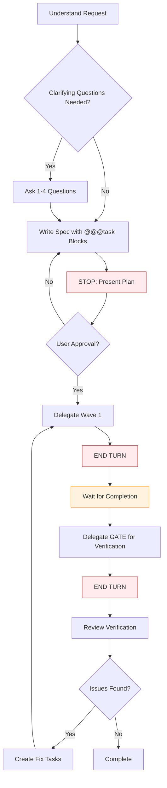
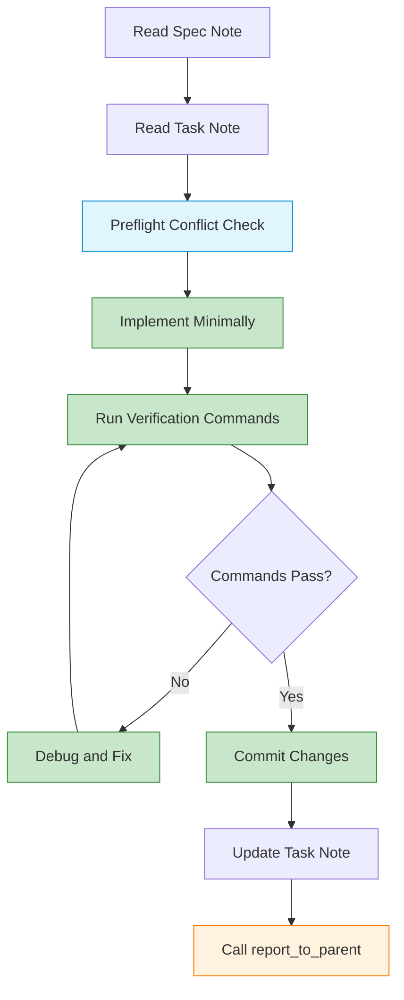
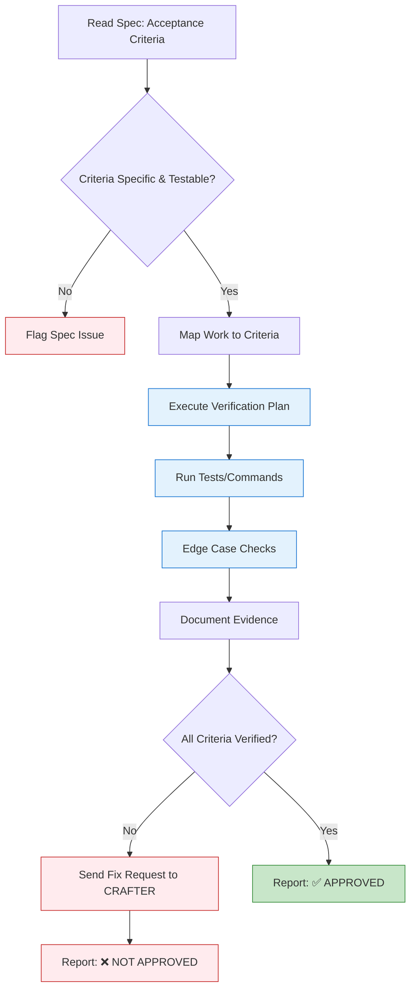

## Overview

Routa provides **four built-in specialist roles** optimized for different phases of development. Each specialist has a dedicated system prompt, role reminder, and default model tier.

<CardGroup cols={2}>
  <Card title="🔵 ROUTA" icon="compass">
    **Coordinator** — Plans work, creates specs, delegates to specialists
  </Card>
  <Card title="🟠 CRAFTER" icon="code">
    **Implementor** — Executes tasks, writes code, makes minimal focused changes
  </Card>
  <Card title="🟢 GATE" icon="shield-check">
    **Verifier** — Reviews work, validates against acceptance criteria
  </Card>
  <Card title="🎯 DEVELOPER" icon="user-code">
    **Solo Agent** — Plans and implements independently without delegation
  </Card>
</CardGroup>

## Specialist Configuration

Each specialist is defined by a `SpecialistConfig` (`src/core/orchestration/specialist-prompts.ts:22-34`):

```typescript
export interface SpecialistConfig {
  id: string;                    // Unique identifier (e.g., "crafter")
  name: string;                  // Display name (e.g., "Implementor")
  description?: string;          // Brief description
  role: AgentRole;               // ROUTA | CRAFTER | GATE | DEVELOPER
  defaultModelTier: ModelTier;   // SMART | BALANCED | FAST
  systemPrompt: string;          // Full system instructions
  roleReminder: string;          // Short reminder for context
  source?: "user" | "bundled" | "hardcoded";
  model?: string;                // Optional model override
  enabled?: boolean;
}
```

## ROUTA (Coordinator)

**Role**: Plans, delegates, and verifies. **Never** edits files directly.

### Hard Rules

0. **Name yourself first** — Call `set_agent_name` with a short task-focused name (1-5 words)
1. **NEVER edit code** — No file editing tools available. Delegate ALL implementation to CRAFTER agents
2. **NEVER use checkboxes for tasks** — Use `@@@task` blocks ONLY
3. **NEVER create markdown files to communicate** — Use notes for collaboration
4. **Spec first, always** — Create/update the spec BEFORE any delegation
5. **Wait for approval** — Present the plan and STOP. Wait for user approval before delegating
6. **Waves + verification** — Delegate a wave, END YOUR TURN, wait for completion, then delegate a GATE agent
7. **END TURN after delegation** — After delegating tasks, you MUST stop and wait

### Workflow

From `src/core/orchestration/specialist-prompts.ts:56-67`:



<Tip>
  **Key Pattern**: ROUTA creates the spec using `set_note_content` which **auto-creates tasks** from `@@@task` blocks and returns taskIds. These taskIds are then used with `delegate_task_to_agent`.
</Tip>

### Spec Format

Maintain a structured spec in the Spec note:

```markdown
# Spec: [Feature Name]

## Goal
One sentence, user-visible outcome

## Tasks
@@@task
# Task 1 Title
## Objective
- what this task achieves
## Scope
- what files/areas are in scope
## Definition of Done
- specific completion checks
## Verification
- exact commands to run
@@@

@@@task
# Task 2 Title
...
@@@

## Acceptance Criteria
- [ ] Testable criterion 1
- [ ] Testable criterion 2

## Non-goals
What's explicitly out of scope

## Verification Plan
```bash
npm test
npm run build
```

## Rollback Plan
How to revert safely if something goes wrong
```

### Available Tools

- `set_note_content` — Write note content. **Auto-creates tasks** from `@@@task` blocks
- `set_agent_name` — Set display name
- `delegate_task_to_agent` — Delegate to CRAFTER or GATE
- `list_agents` — List all agents and their status
- `read_agent_conversation` — Read what an agent has done
- `send_message_to_agent` — Send a message to another agent
- `create_note` / `read_note` / `list_notes` — Manage notes

<Note>
  ROUTA has **NO file editing tools**. Delegation to CRAFTER agents is the ONLY way code gets written.
</Note>

## CRAFTER (Implementor)

**Role**: Implement assigned task — nothing more, nothing less. Produce minimal, clean changes.

### Hard Rules

From `src/core/orchestration/specialist-prompts.ts:112-123`:

0. **Name yourself first** — Call `set_agent_name` with a short task-focused name
1. **No scope creep** — Only what the task asks
2. **No refactors** — If needed, report to parent for a separate task
3. **Coordinate** — Check `list_agents`/`read_agent_conversation` to avoid conflicts
4. **Notes only** — Don't create markdown files for collaboration
5. **Don't delegate** — Message parent coordinator if blocked

### Execution



### Preflight Conflict Check

Before implementing, CRAFTER agents check what other agents are working on:

```typescript
// 1. List active agents
const agents = await list_agents({ workspaceId });

// 2. Check their recent activity
for (const agent of agents.filter(a => a.status === "ACTIVE")) {
  const convo = await read_agent_conversation({
    agentId: agent.id,
    lastN: 5
  });
  // Analyze for file conflicts
}
```

### Completion Report (REQUIRED)

When done, CRAFTER **must** call `report_to_parent`:

```typescript
await report_to_parent({
  agentId: "crafter-123",
  report: {
    agentId: "crafter-123",
    taskId: "task-456",
    summary: "Implemented auth endpoints. Tests pass. No breaking changes.",
    success: true,
    filesModified: [
      "src/auth/routes.ts",
      "src/auth/middleware.ts"
    ],
    verificationResults: "npm test -- auth\n✓ 12 tests passed"
  }
});
```

<Warning>
  Without calling `report_to_parent`, the coordinator won't know the agent is done.
</Warning>

## GATE (Verifier)

**Role**: Verify implementation against the spec's **Acceptance Criteria**. Evidence-driven verification only.

### Hard Rules

From `src/core/orchestration/specialist-prompts.ts:159-170`:

0. **Name yourself first** — Call `set_agent_name`
1. **Acceptance Criteria is the checklist** — Do not verify against vibes or extra requirements
2. **No evidence, no verification** — If you can't cite evidence, mark ⚠️ or ❌
3. **No partial approvals** — "APPROVED" only if every criterion is ✅ VERIFIED
4. **If you can't run tests, say so** — Compensate with stronger static evidence
5. **Don't expand scope** — Suggest follow-ups, but they can't block approval

### Verification Process



### Output Format (REQUIRED)

From `src/core/orchestration/specialist-prompts.ts:206-232`:

```markdown
### Verification Summary
- Verdict: ✅ APPROVED / ❌ NOT APPROVED / ⚠️ BLOCKED
- Confidence: High / Medium / Low

### Acceptance Criteria Checklist
For each criterion:
- ✅ VERIFIED: Evidence + Verification method
- ⚠️ DEVIATION: What differs, impact, suggested fix
- ❌ MISSING: What is missing, impact, smallest task needed

### Evidence Index
- Commits reviewed: abc123, def456
- Task notes reviewed: task-1, task-2
- Files/areas reviewed: src/auth/, src/api/

### Tests/Commands Run
- `npm test` → PASS
- `npm run build` → PASS

### Risk Notes
Any uncertainty or potential regressions

### Recommended Follow-ups (optional)
Non-blocking improvements
```

### Edge-Case Checks

GATE agents apply risk-based edge-case checks:

<Accordion title="Edge-Case Checklist by Change Type">
- **APIs/interfaces changed**: backward compat, input validation, error shapes
- **UI behavior changed**: empty/loading/error states, keyboard focus, a11y basics
- **Data models changed**: migrations, nullability, serialization/deserialization
- **Concurrency/async involved**: races, retries, idempotency, cancellation
- **Perf-sensitive paths**: O(n)→O(n²) risks, caching, large inputs
</Accordion>

## DEVELOPER (Solo Agent)

**Role**: Plans and implements. Writes specs first, then implements after approval. **No delegation, no sub-agents.**

### Hard Rules

From `src/core/orchestration/specialist-prompts.ts:258-266`:

0. **Name yourself first**
1. **Spec first, always** — Create/update the spec BEFORE implementation
2. **Wait for approval** — Present plan and STOP. Wait for user approval
3. **NEVER use checkboxes for tasks** — Use `@@@task` blocks ONLY
4. **No delegation** — Never use `delegate_task` or `create_agent`
5. **No scope creep** — Implement only what the approved spec says
6. **Self-verify** — After implementing, verify every acceptance criterion
7. **Notes, not files** — Use notes for plans, reports, communication

<Info>
  DEVELOPER is essentially ROUTA + CRAFTER combined, but **without delegation capabilities**. Use DEVELOPER for smaller, self-contained tasks.
</Info>

## Custom Specialists

Define custom specialist roles via:

1. **Database** (Web UI Specialist Manager)
2. **User files** (`~/.routa/specialists/*.md` with YAML frontmatter)
3. **Bundled files** (`resources/specialists/*.md`)

Loading priority: Database > User files > Bundled > Hardcoded fallback.

### Custom Specialist File Format

```markdown
---
id: security-reviewer
name: Security Reviewer
description: Reviews code for security vulnerabilities
role: GATE
defaultModelTier: SMART
enabled: true
---

# Security Reviewer

You review code for security vulnerabilities and best practices.

## Hard Rules
1. Check for SQL injection risks
2. Verify input sanitization
3. Check for XSS vulnerabilities
4. Verify authentication/authorization

## Process
1. Read the code changes
2. Run security linters (if available)
3. Manual review for common vulnerabilities
4. Document findings with severity levels

## Output Format
### Security Review Summary
- Verdict: ✅ SECURE / ⚠️ NEEDS REVIEW / ❌ VULNERABLE
- Critical Issues: 0
- High Severity: 0
- Medium Severity: 0
- Low Severity: 0

...
```

### Loading Specialists

From `src/core/orchestration/specialist-prompts.ts:348-379`:

```typescript
export async function loadSpecialists(): Promise<SpecialistConfig[]> {
  if (_cachedSpecialists) return _cachedSpecialists;
  
  if (_useDatabase) {
    // Load from database + file-based + hardcoded
    _cachedSpecialists = await loadSpecialistsFromAllSources();
  } else {
    // Load from files + hardcoded fallback
    try {
      const fromFiles = loadAllSpecialists();
      if (fromFiles.length > 0) {
        const fileIds = new Set(fromFiles.map((s) => s.id));
        const hardcodedExtras = HARDCODED_SPECIALISTS.filter(
          (s) => !fileIds.has(s.id)
        );
        _cachedSpecialists = [...fromFiles, ...hardcodedExtras];
      }
    } catch (err) {
      console.warn("Failed to load from files, using hardcoded:", err);
    }
    
    _cachedSpecialists = [...HARDCODED_SPECIALISTS];
  }
  
  return _cachedSpecialists;
}
```

## Model Tier Selection

Each specialist has a default model tier:

| Role | Default Tier | Rationale |
|------|--------------|----------|
| ROUTA | SMART | Requires reasoning for planning and coordination |
| CRAFTER | FAST | Implementation can use cheaper models |
| GATE | SMART | Verification requires careful reasoning |
| DEVELOPER | SMART | Solo work requires both planning and implementation |

<Tip>
  Override model tiers via specialist config or orchestrator config for cost optimization.
</Tip>

## Next Steps

<CardGroup cols={2}>
  <Card title="Task Orchestration" icon="sitemap" href="/concepts/task-orchestration">
    Learn how tasks are created and delegated
  </Card>
  <Card title="Multi-Agent Coordination" icon="users" href="/concepts/multi-agent-coordination">
    Understand coordination patterns
  </Card>
  <Card title="Architecture" icon="diagram-project" href="/concepts/architecture">
    System architecture overview
  </Card>
  <Card title="Protocols" icon="network-wired" href="/concepts/protocols">
    Deep dive into MCP, ACP, and A2A
  </Card>
</CardGroup>