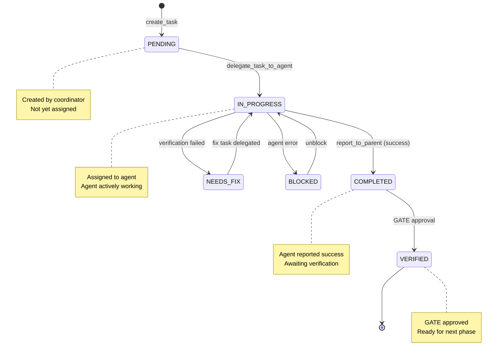
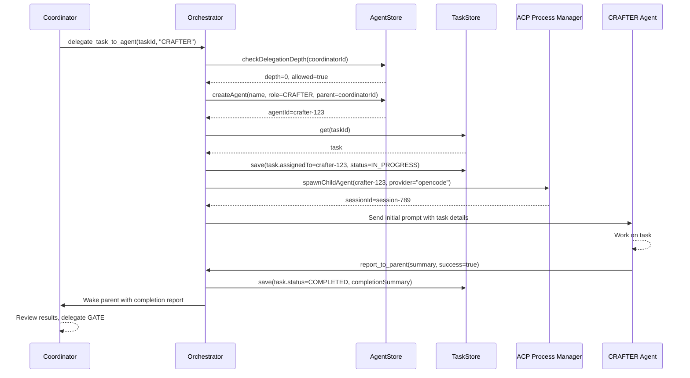

## Overview

Routa's task orchestration system enables **structured work breakdown** and **parallel execution** through `@@@task` blocks, delegation, and verification cycles.

<Info>
  **Core Concept**: Tasks are the atomic unit of work. The coordinator creates tasks in the spec, delegates them to specialist agents, and tracks completion through reports.
</Info>

## Task Lifecycle



## Task Model

From the Task model definition:

```typescript
export interface Task {
  id: string;
  workspaceId: string;
  title: string;
  objective: string;              // What this task achieves
  scope?: string;                 // Files/areas in scope
  acceptanceCriteria?: string[];  // Completion checks
  verificationCommands?: string[]; // Commands to run
  status: TaskStatus;
  assignedTo?: string;            // Agent ID
  dependencies?: string[];        // Task IDs this depends on
  parallelGroup?: string;         // Group for parallel execution
  completionSummary?: string;     // Agent's completion report
  verificationVerdict?: VerificationVerdict;
  verificationReport?: string;
  createdAt: Date;
  updatedAt: Date;
}
```

## Creating Tasks

### Manual Task Creation

Tasks can be created directly using the `create_task` tool:

```typescript
await create_task({
  title: "Implement JWT Authentication",
  objective: "Build JWT-based auth for the API layer with login/logout endpoints",
  workspaceId: "workspace-1",
  scope: "src/auth/, src/middleware/",
  acceptanceCriteria: [
    "Login endpoint returns valid JWT token",
    "Logout endpoint invalidates token",
    "Protected routes require valid token",
    "All tests pass"
  ],
  verificationCommands: [
    "npm test -- auth",
    "npm run lint"
  ]
});
```

### Auto-Creation from @@@task Blocks

The **recommended pattern** is to use `@@@task` blocks in the spec note. The `set_note_content` tool automatically parses and creates tasks:

<Accordion title="Task Block Parser Implementation">
From `src/core/orchestration/task-block-parser.ts:69-113`:

```typescript
export function parseTaskBlockContent(blockContent: string): ParsedTask | null {
  const normalized = normalizeLineEndings(blockContent);
  const lines = normalized.split("\n");
  let title: string | null = null;
  let contentStartIndex = 0;
  
  // Find the first # heading - that's the title
  for (let i = 0; i < lines.length; i++) {
    const h1Match = lines[i].match(/^#\s+(.+)$/);
    if (h1Match) {
      const extractedTitle = h1Match[1].trim();
      if (extractedTitle.length > 0) {
        title = extractedTitle;
        contentStartIndex = i + 1;
        break;
      }
    }
  }
  
  if (!title) {
    return null;
  }
  
  const content = lines.slice(contentStartIndex).join("\n").trim();
  
  // Extract known sections
  const sections: ParsedTask["sections"] = {
    objective: extractSection(content, "Objective"),
    scope: extractSection(content, "Scope"),
    inputs: extractSection(content, "Inputs"),
    definitionOfDone:
      extractSection(content, "Definition of Done") ??
      extractSection(content, "Definition Of Done"),
    verification: extractSection(content, "Verification"),
    outputRequired:
      extractSection(content, "Output required") ??
      extractSection(content, "Output Required"),
  };
  
  return { title, content, sections };
}
```
</Accordion>

### Task Block Format

```markdown
@@@task
# Implement Authentication System
## Objective
Build JWT-based auth for the API layer with login/logout endpoints

## Scope
- src/auth/
- src/middleware/
- Do NOT modify existing user database schema

## Inputs
- Link to spec section: [Authentication Design](#authentication-design)
- Existing user model: src/models/user.ts

## Definition of Done
- [ ] Login endpoint returns valid JWT token
- [ ] Logout endpoint invalidates token
- [ ] Protected routes require valid token
- [ ] All tests pass
- [ ] No breaking changes to existing APIs

## Verification
```bash
npm test -- auth
npm run lint
curl -X POST http://localhost:3000/auth/login -d '{"user":"test","pass":"test"}'
```
@@@
```

<Tip>
  Use `@@@task` blocks in your spec and call `set_note_content(noteId="spec", content=...)`. The system will automatically parse the blocks, create tasks, and return taskIds.
</Tip>

## Delegation Patterns

### Basic Delegation

```typescript
// 1. Create task (or get taskId from @@@task parsing)
const taskResult = await create_task({
  title: "Implement feature X",
  objective: "...",
  workspaceId: "workspace-1"
});

const taskId = taskResult.data.taskId;

// 2. Delegate to a CRAFTER agent
await delegate_task_to_agent({
  taskId,
  callerAgentId: "routa-coordinator-123",
  callerSessionId: "session-456",
  workspaceId: "workspace-1",
  specialist: "CRAFTER",
  provider: "opencode",  // or "claude", "copilot", etc.
  waitMode: "immediate"
});
```

### Wave-Based Delegation (Parallel Execution)

Delegate multiple tasks and wait for all to complete:

```typescript
// Wave 1: Implementation
const task1 = await create_task({ title: "API endpoints", ... });
const task2 = await create_task({ title: "Database models", ... });
const task3 = await create_task({ title: "Unit tests", ... });

// Delegate all with after_all mode
await delegate_task_to_agent({
  taskId: task1.data.taskId,
  specialist: "CRAFTER",
  waitMode: "after_all"
});

await delegate_task_to_agent({
  taskId: task2.data.taskId,
  specialist: "CRAFTER",
  waitMode: "after_all"
});

await delegate_task_to_agent({
  taskId: task3.data.taskId,
  specialist: "CRAFTER",
  waitMode: "after_all"
});

// Coordinator's turn ends. Will be woken when ALL three complete.
```

<Info>
  **After-All Mode**: Creates a delegation group. The coordinator is woken only when all agents in the group complete. This enables true parallel execution.
</Info>

### Delegation with Additional Instructions

```typescript
await delegate_task_to_agent({
  taskId: "task-789",
  specialist: "CRAFTER",
  additionalInstructions: `
    IMPORTANT: This task requires coordination with agent-abc who is working on the database schema.
    Before implementing, read their conversation to ensure compatibility.
  `
});
```

## Orchestration Flow

The orchestrator handles the end-to-end delegation lifecycle (`src/core/orchestration/orchestrator.ts:217-425`):



### Delegation Depth Enforcement

From `src/core/orchestration/delegation-depth.ts:17-21`:

```typescript
export const MAX_DELEGATION_DEPTH = 2;

// Depth 0: User-created agents
// Depth 1: First-level delegated agents (children)
// Depth 2: Second-level delegated agents (grandchildren - max)
```

When an agent at depth 2 tries to delegate:

```typescript
const depthCheck = await checkDelegationDepth(agentStore, agentId);

if (!depthCheck.allowed) {
  return errorResult(
    `Cannot create sub-agent: maximum delegation depth (2) reached. ` +
    `You are at depth ${depthCheck.currentDepth}. ` +
    `Please complete this task directly instead of delegating further.`
  );
}
```

## Task Dependencies

Tasks can declare dependencies to enforce execution order:

```typescript
const setupTask = await create_task({
  title: "Setup database",
  objective: "Initialize database schema",
  workspaceId: "workspace-1"
});

const dataTask = await create_task({
  title: "Load seed data",
  objective: "Populate database with test data",
  workspaceId: "workspace-1",
  dependencies: [setupTask.data.taskId]  // Can't start until setup completes
});
```

<Note>
  Dependency enforcement is currently **advisory**. Agents should check `list_tasks` and respect dependencies, but the system does not automatically block execution.
</Note>

## Parallel Groups

Tasks can be grouped for parallel execution:

```typescript
// All tasks in "wave-1" can execute in parallel
const task1 = await create_task({
  title: "API endpoints",
  parallelGroup: "wave-1",
  ...
});

const task2 = await create_task({
  title: "Database models",
  parallelGroup: "wave-1",
  ...
});

const task3 = await create_task({
  title: "Unit tests",
  parallelGroup: "wave-1",
  ...
});
```

Combine with `waitMode="after_all"` for wave-based coordination:

```typescript
for (const task of wave1Tasks) {
  await delegate_task_to_agent({
    taskId: task.id,
    specialist: "CRAFTER",
    waitMode: "after_all"
  });
}

// Coordinator waits for entire wave to complete
```

## Verification Cycle

After implementation, delegate a GATE agent to verify:

```typescript
// 1. Implementation wave completes
// Coordinator is woken with completion reports

// 2. Delegate GATE agent for verification
const verificationTask = await create_task({
  title: "Verify Authentication Implementation",
  objective: "Verify all acceptance criteria from the Authentication spec",
  workspaceId: "workspace-1",
  acceptanceCriteria: [
    "Login endpoint works correctly",
    "Logout endpoint works correctly",
    "Protected routes require authentication",
    "All tests pass"
  ]
});

await delegate_task_to_agent({
  taskId: verificationTask.data.taskId,
  specialist: "GATE",
  waitMode: "immediate"
});

// 3. GATE agent reports back with verdict
// If issues found: Create fix tasks and re-delegate
// If approved: Move to next wave
```

### Verification Verdicts

```typescript
export enum VerificationVerdict {
  APPROVED = "APPROVED",
  NOT_APPROVED = "NOT_APPROVED",
  BLOCKED = "BLOCKED"
}
```

GATE agents set the verdict in their report:

```typescript
await report_to_parent({
  agentId: "gate-123",
  report: {
    agentId: "gate-123",
    taskId: "verification-task-456",
    summary: "✅ APPROVED. All acceptance criteria verified. High confidence.",
    success: true,
    verificationResults: `
### Verification Summary
- Verdict: ✅ APPROVED
- Confidence: High

### Tests Run
- npm test -- auth → PASS (12/12 tests)
- curl login endpoint → 200 OK, valid JWT token

### Evidence
- Commits reviewed: abc123, def456
- Files reviewed: src/auth/routes.ts, src/auth/middleware.ts
    `
  }
});
```

## Task Tracking Tools

### List Tasks

```typescript
const tasks = await list_tasks({ workspaceId: "workspace-1" });

// Returns:
[
  {
    id: "task-1",
    title: "Implement JWT Authentication",
    status: "COMPLETED",
    assignedTo: "crafter-123",
    verificationVerdict: "APPROVED"
  },
  {
    id: "task-2",
    title: "Add password reset flow",
    status: "IN_PROGRESS",
    assignedTo: "crafter-456",
    verificationVerdict: null
  }
]
```

### Get Task Details

```typescript
const task = await get_task("task-1");

// Returns full Task object with:
// - objective, scope, acceptanceCriteria
// - assignedTo, status, completionSummary
// - verificationVerdict, verificationReport
// - createdAt, updatedAt
```

### Convert Task Blocks

Manually convert `@@@task` blocks from any content:

```typescript
const result = await convert_task_blocks({
  content: specContent,
  workspaceId: "workspace-1",
  noteId: "spec"  // Optional: link tasks to a note
});

// Returns:
{
  taskIds: ["task-1", "task-2", "task-3"],
  contentWithPlaceholders: "...<!-- task-placeholder-0 -->..."
}
```

<Tip>
  Use `convert_task_blocks` when you need to create tasks from existing content. Most of the time, `set_note_content` will auto-convert for you.
</Tip>

## Best Practices

### 1. Atomic Task Scope

Keep tasks small and focused (~30 minutes of work):

<CodeGroup>
```markdown Good: Atomic Task
@@@task
# Add Login Endpoint
## Objective
Implement POST /auth/login endpoint that validates credentials and returns JWT token

## Scope
- src/auth/routes.ts (add login route)
- src/auth/jwt.ts (generate token)
@@@
```

```markdown Bad: Too Broad
@@@task
# Implement Authentication
## Objective
Build complete authentication system with login, logout, password reset, email verification, 2FA, OAuth, and session management
@@@
```
</CodeGroup>

### 2. Clear Acceptance Criteria

Make criteria **specific and testable**:

<CodeGroup>
```markdown Good: Testable Criteria
## Definition of Done
- [ ] POST /auth/login returns 200 with JWT token for valid credentials
- [ ] POST /auth/login returns 401 for invalid credentials
- [ ] JWT token expires after 1 hour
- [ ] npm test -- auth passes all tests
```

```markdown Bad: Vague Criteria
## Definition of Done
- [ ] Login works
- [ ] Security is good
- [ ] No bugs
```
</CodeGroup>

### 3. Wave-Based Coordination

Group related tasks into waves for parallel execution:

```markdown
## Wave 1: Core Implementation
- Task 1: Database models
- Task 2: API routes
- Task 3: Unit tests
(Delegate with waitMode="after_all")

## Wave 2: Verification
- Task 4: GATE verification
(Delegate with waitMode="immediate")

## Wave 3: Integration
- Task 5: Frontend integration
- Task 6: E2E tests
(Delegate with waitMode="after_all")
```

### 4. Verification Commands

Provide exact commands for CRAFTER and GATE agents to run:

```markdown
## Verification
```bash
# Build
npm run build

# Tests
npm test -- src/auth

# Linting
npm run lint -- src/auth

# Manual verification
curl -X POST http://localhost:3000/auth/login \
  -H "Content-Type: application/json" \
  -d '{"username":"test","password":"test"}'
```
```

## Next Steps

<CardGroup cols={2}>
  <Card title="Specialist Roles" icon="user-tie" href="/concepts/specialist-roles">
    Learn about ROUTA, CRAFTER, GATE roles
  </Card>
  <Card title="Multi-Agent Coordination" icon="users" href="/concepts/multi-agent-coordination">
    Understand coordination patterns
  </Card>
  <Card title="Architecture" icon="diagram-project" href="/concepts/architecture">
    System architecture overview
  </Card>
  <Card title="Protocols" icon="network-wired" href="/concepts/protocols">
    Deep dive into MCP, ACP, and A2A
  </Card>
</CardGroup>