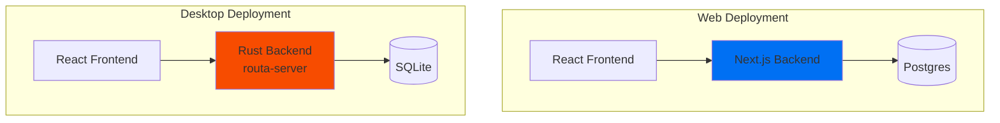

Routa.js implements a unique **dual-backend architecture** that supports both web and desktop deployments with identical APIs:

- **Next.js Backend** (TypeScript) — Web deployment on Vercel with Postgres/SQLite
- **Rust Backend** (Axum) — Desktop application with embedded server and SQLite

## Architecture Overview

Both backends implement **identical REST APIs** for seamless frontend compatibility. The same React frontend can run against either backend without modification.



## Next.js Backend

Located in `src/app/api/`, the Next.js backend provides:

- **Web-optimized** deployment on Vercel
- **Serverless-ready** with edge runtime support
- **Postgres** via Neon Serverless (DATABASE_URL)
- **SQLite** fallback for local development

### Key Files

- `src/core/routa-system.ts` — Core system initialization
- `src/app/api/` — Next.js API routes
- `src/core/db/schema.ts` — Postgres schema
- `src/core/db/sqlite-schema.ts` — SQLite schema

### Storage Modes

The Next.js backend supports three storage modes (src/core/routa-system.ts:1-290):

1. **InMemory** — No database, for quick dev/tests
2. **Postgres** — When DATABASE_URL is set (Neon Serverless)
3. **SQLite** — When ROUTA_DB_DRIVER=sqlite (local file)

## Rust Backend

Located in `crates/routa-server/`, the Rust backend provides:

- **Desktop-optimized** with embedded server
- **Single binary** distribution (Tauri)
- **SQLite** for local persistence
- **CLI interface** for automation

### Crate Structure

```
crates/
├── routa-core/     # Core logic (stores, orchestration)
├── routa-server/   # Axum HTTP server
├── routa-rpc/      # JSON-RPC protocol handlers
└── routa-cli/      # Command-line interface
```

### API Implementation

The Rust server in `crates/routa-server/src/api/` mirrors the Next.js API routes:

- `/api/health` — Health check endpoint
- `/api/agents` — Agent management
- `/api/tasks` — Task operations
- `/api/workspaces` — Workspace CRUD
- `/api/mcp` — MCP protocol endpoint
- `/api/acp` — ACP protocol endpoint
- `/api/a2a` — A2A protocol endpoint

## API Parity

Both backends must maintain **identical REST API contracts**. The project includes validation tools:

```bash
# Check API parity between Next.js and Rust
npm run api:check

# Run contract tests against Next.js
npm run api:test:nextjs

# Run contract tests against Rust
npm run api:test:rust

# Validate OpenAPI schema
npm run api:schema:validate
```

See package.json:26-39 for all API validation commands.

## Database Configuration

Both backends use Drizzle ORM but with different drivers:

### Next.js (Postgres)

```typescript
import { neon } from '@neondatabase/serverless';
import { drizzle } from 'drizzle-orm/neon-http';

const sql = neon(process.env.DATABASE_URL!);
const db = drizzle(sql);
```

### Next.js (SQLite)

```typescript
import Database from 'better-sqlite3';
import { drizzle } from 'drizzle-orm/better-sqlite3';

const sqlite = new Database('routa.db');
const db = drizzle(sqlite);
```

### Rust (SQLite)

The Rust backend uses `rusqlite` with the same schema as the TypeScript SQLite implementation.

## Development Workflow

### Web Development

```bash
# Start Next.js dev server (port 3000)
npm run dev

# With Postgres
export DATABASE_URL="postgresql://..."
npm run dev

# With SQLite
export ROUTA_DB_DRIVER=sqlite
npm run dev
```

### Desktop Development

```bash
# Start Tauri with Rust backend (port 3210)
npm run tauri dev

# Or start Rust server standalone
npm run start:desktop:server
```

### Testing Against Both Backends

```bash
# Terminal 1: Start Next.js
npm run dev

# Terminal 2: Run tests against Next.js
BASE_URL=http://localhost:3000 npm run api:test

# Terminal 3: Start Rust server
npm run start:desktop:server

# Terminal 4: Run tests against Rust
BASE_URL=http://localhost:3210 npm run api:test
```

## Why Dual Backend?

### Next.js Advantages

- **Serverless deployment** on Vercel
- **Edge runtime** support
- **Postgres** for scalable storage
- **Web-optimized** caching and routing

### Rust Advantages

- **Single binary** distribution
- **No external dependencies** (embedded SQLite)
- **Better performance** for desktop use
- **CLI tools** for automation
- **Offline-first** operation

## Related Resources

- [Database Configuration](/development/database) — Detailed database setup
- [Testing Guide](/development/testing) — Testing both backends
- [Contributing Guide](/development/contributing) — Development guidelines
