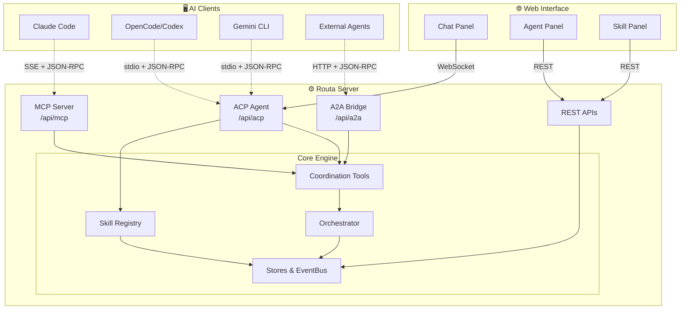

# Welcome to Routa

Routa orchestrates AI agents to collaborate on complex development tasks through specialized roles and real-time coordination. Instead of a single AI handling everything, Routa enables multiple agents to work together—one plans, another implements, and a third verifies—creating a more robust and scalable development workflow.

## What Routa Does

Routa parses natural language into structured intent (Spec with Tasks), then shares this unified intent across all downstream agents, ensuring context consistency throughout the workflow.

<CardGroup cols={2}>
  <Card title="Break down complex work" icon="sitemap">
    Automatically decompose large features into manageable tasks across specialized agents
  </Card>
  <Card title="Coordinate execution" icon="arrows-spin">
    Orchestrate task delegation, inter-agent messaging, and real-time event streaming
  </Card>
  <Card title="Verify quality" icon="shield-check">
    Dedicated review agents validate work against acceptance criteria before completion
  </Card>
  <Card title="Connect AI platforms" icon="plug">
    Unified protocols for Claude Code, OpenCode, Codex, and Gemini integration
  </Card>
</CardGroup>

## Multi-Protocol Architecture

Routa uses three protocols to enable seamless multi-agent coordination:

<AccordionGroup>
  <Accordion title="MCP (Model Context Protocol)" icon="handshake">
    Coordination tools for agent collaboration including task delegation, inter-agent messaging, and shared notes. Built on [Anthropic's Model Context Protocol](https://modelcontextprotocol.io/).
  </Accordion>
  
  <Accordion title="ACP (Agent Client Protocol)" icon="terminal">
    Spawns and manages agent processes for Claude Code, OpenCode, Codex, and Gemini CLI. Handles lifecycle management and communication channels.
  </Accordion>
  
  <Accordion title="A2A (Agent-to-Agent Protocol)" icon="network-wired">
    External federation interface for cross-platform agent communication. Enables agents from different systems to collaborate.
  </Accordion>
</AccordionGroup>

## Specialist Roles

Routa includes four built-in specialist roles, plus support for custom specialists:

| Role | Icon | Description |
|------|------|-------------|
| **Coordinator** | 🔵 | Plans work, parses intent into structured Spec, creates tasks, delegates to specialists |
| **Implementor** | 🟠 | Executes implementation tasks, writes code, makes minimal focused changes |
| **Verifier** | 🟢 | Reviews work, validates against acceptance criteria, approves or requests fixes |
| **Developer** | 🎯 | Plans and implements independently without delegation (single-agent mode) |
| **Custom** | 🛠️ | User-defined specialist roles with custom system prompts, model tiers, and behaviors |

## Key Features

<CardGroup cols={2}>
  <Card title="Task Orchestration" icon="diagram-project">
    Create tasks, delegate to agents, track dependencies, and enable parallel execution
  </Card>
  
  <Card title="Inter-Agent Communication" icon="comments">
    Message passing between agents, shared conversation history, and completion reports
  </Card>
  
  <Card title="Skills System" icon="puzzle-piece">
    OpenCode-compatible skill discovery and dynamic loading for extensible capabilities
  </Card>
  
  <Card title="ACP Registry" icon="box-open">
    Discover and install pre-configured agents from the community registry (npx, uvx, binaries)
  </Card>
  
  <Card title="Custom MCP Servers" icon="server">
    Register and manage user-defined MCP servers (stdio/http/sse) alongside built-in coordination
  </Card>
  
  <Card title="Custom Specialists" icon="user-gear">
    Define custom agent roles via Web UI, REST API, or Markdown files with YAML frontmatter
  </Card>
  
  <Card title="GitHub Virtual Workspace" icon="github">
    Import GitHub repos as virtual workspaces for browsing and code review without local clones
  </Card>
  
  <Card title="Real-Time UI" icon="chart-line">
    Live agent status, task progress tracking, and streaming chat interface
  </Card>
</CardGroup>

## Get Started

<CardGroup cols={2}>
  <Card title="Quickstart" icon="rocket" href="/quickstart">
    Get up and running in 5 minutes with the desktop app or web demo
  </Card>
  
  <Card title="Installation" icon="download" href="/installation">
    Installation instructions for desktop, web deployment, and Docker
  </Card>
  
  <Card title="Core Concepts" icon="lightbulb" href="/concepts/architecture">
    Understand the architecture and coordination patterns
  </Card>
  
  <Card title="Specialists" icon="users" href="/specialists/overview">
    Learn about built-in roles and how to create custom specialists
  </Card>
</CardGroup>

## Distribution Notice

<Note>
  Routa primarily provides a **Tauri desktop application** (binary distribution). The web version is available **only for demo purposes** and is not the main deployment target.
</Note>

## Architecture Overview

Routa uses a dual-backend architecture for maximum flexibility:

- **Next.js Backend** (TypeScript) — Web deployment on Vercel with Postgres/SQLite
- **Rust Backend** (Axum) — Desktop application with embedded server and SQLite

Both backends implement identical REST APIs for seamless frontend compatibility.

## Next Steps

<Steps>
  <Step title="Choose Your Deployment">
    Decide between desktop app (recommended), web demo, or Docker deployment
  </Step>
  
  <Step title="Install Dependencies">
    Follow the [installation guide](/installation) for your chosen deployment method
  </Step>
  
  <Step title="Run Your First Coordination">
    Try the [quickstart guide](/quickstart) to see multi-agent coordination in action
  </Step>
  
  <Step title="Explore Capabilities">
    Learn about [core concepts](/core-concepts) and [specialist roles](/specialists)
  </Step>
</Steps>

## Community & Support

<CardGroup cols={2}>
  <Card title="GitHub" icon="github" href="https://github.com/yourusername/routa">
    View source code, report issues, and contribute
  </Card>
  
  <Card title="API Reference" icon="book" href="/api/overview">
    Explore the full API reference and protocol specifications
  </Card>
</CardGroup>
