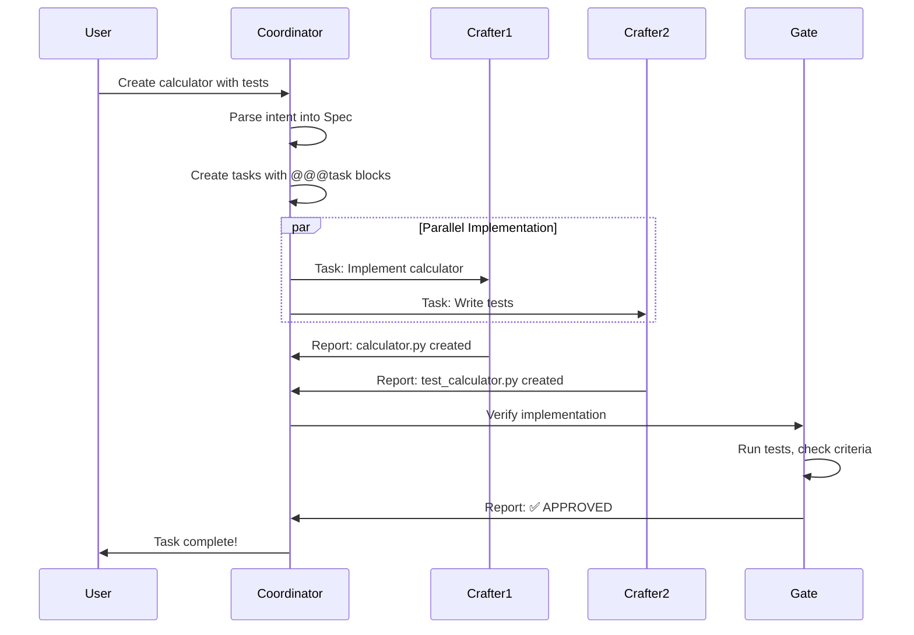

# Quickstart Guide

This guide will get you up and running with Routa in 5 minutes. You'll start the application and run your first multi-agent coordination workflow.

<Note>
  Routa primarily provides a **desktop application** (Tauri-based). The web version is available for demo purposes only.
</Note>

## Prerequisites

Before you begin, ensure you have:

- Node.js 22 or later
- npm or another package manager
- Git (for cloning the repository)
- An AI provider API key (Anthropic, OpenAI, etc.)

## Choose Your Path

<CardGroup cols={2}>
  <Card title="Desktop App" icon="desktop" iconType="solid">
    Recommended for production use
  </Card>
  <Card title="Web Demo" icon="browser" iconType="solid">
    Quick testing and evaluation
  </Card>
</CardGroup>

<Tabs>
  <Tab title="Desktop App">
    ## Desktop Application (Recommended)

    The desktop app provides the full Routa experience with an embedded Rust server and SQLite database.

    <Steps>
      <Step title="Clone the Repository">
        ```bash
        git clone https://github.com/yourusername/routa.git
        cd routa
        ```
      </Step>

      <Step title="Install Dependencies">
        ```bash
        npm install --legacy-peer-deps
        ```
        
        <Note>
          The `--legacy-peer-deps` flag is required due to peer dependency conflicts in some packages.
        </Note>
      </Step>

      <Step title="Start the Desktop App">
        ```bash
        npm run tauri dev
        ```
        
        This will:
        - Build the Next.js frontend
        - Compile the Rust backend
        - Launch the Tauri desktop application
        - Initialize the SQLite database
      </Step>

      <Step title="Configure API Keys">
        On first launch, configure your AI provider in Settings:
        
        1. Click the **Settings** icon in the sidebar
        2. Navigate to **API Configuration**
        3. Add your API key for your preferred provider:
           - Anthropic (Claude)
           - OpenAI (GPT models)
           - Google (Gemini)
        
        <Warning>
          Keep your API keys secure. Never commit them to version control.
        </Warning>
      </Step>
    </Steps>
  </Tab>

  <Tab title="Web Demo">
    ## Web Demo (Testing Only)

    The web version runs on localhost and is suitable for quick testing.

    <Steps>
      <Step title="Clone the Repository">
        ```bash
        git clone https://github.com/yourusername/routa.git
        cd routa
        ```
      </Step>

      <Step title="Install Dependencies">
        ```bash
        npm install --legacy-peer-deps
        ```
      </Step>

      <Step title="Configure Environment">
        Create a `.env.local` file in the project root:
        
        ```bash .env.local
        # Database (SQLite for local development)
        ROUTA_DB_DRIVER=sqlite
        ROUTA_DB_PATH=./routa.db
        
        # API Configuration
        ANTHROPIC_AUTH_TOKEN=your_anthropic_key_here
        # Or use OpenAI:
        # OPENAI_API_KEY=your_openai_key_here
        ```
      </Step>

      <Step title="Start Development Server">
        ```bash
        npm run dev
        ```
        
        Open [http://localhost:3000](http://localhost:3000) in your browser.
      </Step>
    </Steps>

    <Warning>
      The web demo is not recommended for production use. Use the desktop app or Docker deployment instead.
    </Warning>
  </Tab>
</Tabs>

## Your First Coordination

Once the application is running, let's try a simple multi-agent coordination workflow.

<Steps>
  <Step title="Create a Workspace">
    1. Click **Workspaces** in the sidebar
    2. Click **New Workspace**
    3. Name it "Quick Test"
    4. Set the path to an empty directory or test project
  </Step>

  <Step title="Start a Coordination Session">
    Click the **Chat** panel and enter a task:
    
    ```
    Create a simple Python calculator module with functions for add, subtract, multiply, and divide. Include unit tests.
    ```
  </Step>

  <Step title="Watch the Agents Work">
    You'll see the coordination flow:
    
    <AccordionGroup>
      <Accordion title="🔵 Coordinator Agent" defaultOpen>
        - Analyzes your requirement
        - Creates a structured Spec with tasks
        - Breaks down into:
          1. Implement calculator functions
          2. Write unit tests
          3. Verify implementation
      </Accordion>
      
      <Accordion title="🟠 Implementor Agents">
        - Two CRAFTER agents spawn in parallel
        - One implements the calculator module
        - Another writes the test suite
        - Both report completion to the coordinator
      </Accordion>
      
      <Accordion title="🟢 Verifier Agent">
        - GATE agent reviews the implementation
        - Runs unit tests
        - Validates against acceptance criteria
        - Reports verification results
      </Accordion>
    </AccordionGroup>
  </Step>

  <Step title="Review the Results">
    Once complete, you'll see:
    - **Files Created**: `calculator.py`, `test_calculator.py`
    - **Tests Passed**: All unit tests green
    - **Verification**: Complete with evidence
    
    Check the **Agent Panel** to see conversation history and task details.
  </Step>
</Steps>

## Understanding the Workflow

Here's what happened behind the scenes:



## CLI Alternative

You can also use the Rust CLI for coordination:

<CodeGroup>
```bash Prompt Mode
# Quick coordination with a single command
routa -p "Create a Python calculator with tests"

# With custom workspace
routa -p "Add OAuth login" --workspace-id my-project
```

```bash Interactive Chat
# Start interactive session with an agent
routa chat --workspace-id default --provider opencode --role DEVELOPER
```

```bash ACP Server Mode
# Run as an ACP server for other agents to connect
routa acp --workspace-id my-project --provider opencode
```
</CodeGroup>

## Next Steps

<CardGroup cols={2}>
  <Card title="Core Concepts" icon="lightbulb" href="/core-concepts">
    Learn about specs, tasks, and coordination patterns
  </Card>
  
  <Card title="Specialists" icon="users" href="/specialists">
    Understand roles and create custom specialists
  </Card>
  
  <Card title="Configuration" icon="gear" href="/configuration">
    Configure workspaces, MCP servers, and API providers
  </Card>
  
  <Card title="API Reference" icon="code" href="/api-reference">
    Explore the full REST and protocol APIs
  </Card>
</CardGroup>

## Troubleshooting

<AccordionGroup>
  <Accordion title="Desktop app won't start" icon="triangle-exclamation">
    **Issue**: Tauri build fails or app crashes on launch
    
    **Solutions**:
    - Ensure you have Rust installed: `curl --proto '=https' --tlsv1.2 -sSf https://sh.rustup.rs | sh`
    - On Linux, install WebKit dependencies: `sudo apt install webkit2gtk-4.0`
    - On Windows, install Visual Studio Build Tools
    - Check logs in the terminal for specific errors
  </Accordion>
  
  <Accordion title="Database initialization fails" icon="database">
    **Issue**: SQLite database errors on first run
    
    **Solutions**:
    - Delete the database file and restart: `rm routa.db`
    - Check file permissions in the data directory
    - Ensure `better-sqlite3` is properly installed: `npm rebuild better-sqlite3`
  </Accordion>
  
  <Accordion title="Agent spawn fails" icon="robot">
    **Issue**: Cannot spawn OpenCode or other ACP agents
    
    **Solutions**:
    - Verify the agent binary is installed and in PATH
    - For OpenCode: `npx opencode-ai@latest --version`
    - For Claude: Install from VS Code marketplace
    - Check Settings → ACP Providers for configuration
  </Accordion>
  
  <Accordion title="API key errors" icon="key">
    **Issue**: Authentication failures with AI providers
    
    **Solutions**:
    - Verify your API key is valid and has proper permissions
    - Check rate limits and quota on your provider account
    - For Anthropic: Ensure you have access to Claude Code SDK
    - Add API key to Settings → API Configuration
  </Accordion>
</AccordionGroup>

## Getting Help

If you run into issues:

- Check the [full installation guide](/installation) for detailed setup instructions
- Review [common issues](https://github.com/yourusername/routa/issues) on GitHub
- Join our community discussions
- File a bug report with logs and reproduction steps
